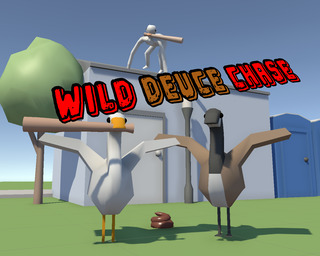
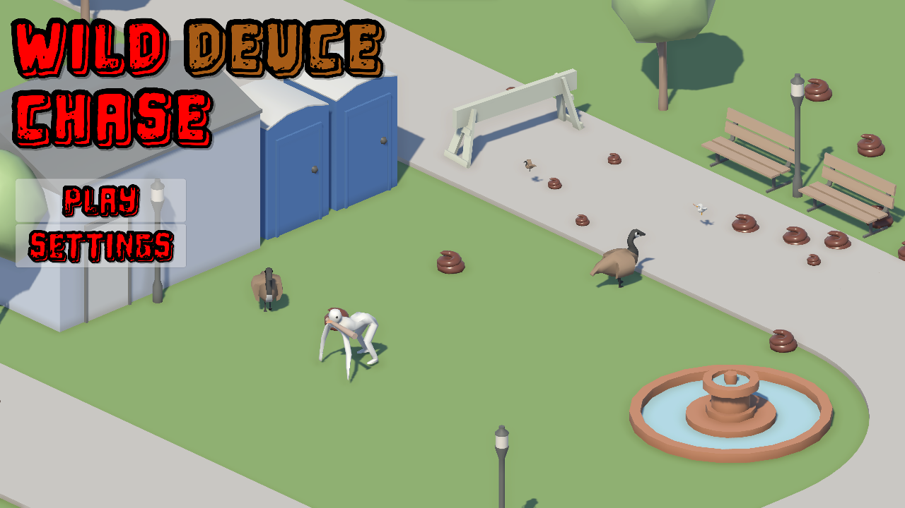
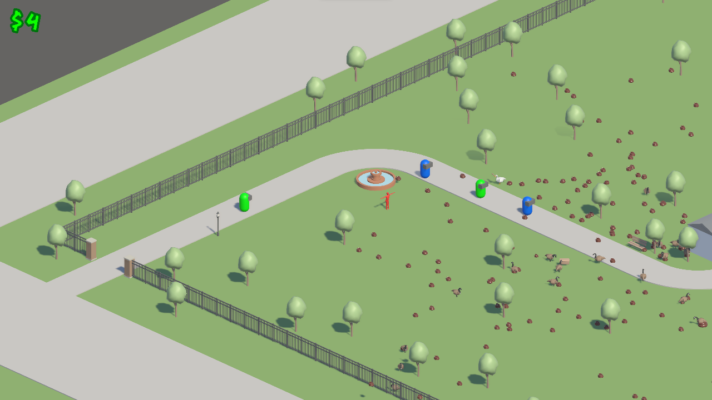
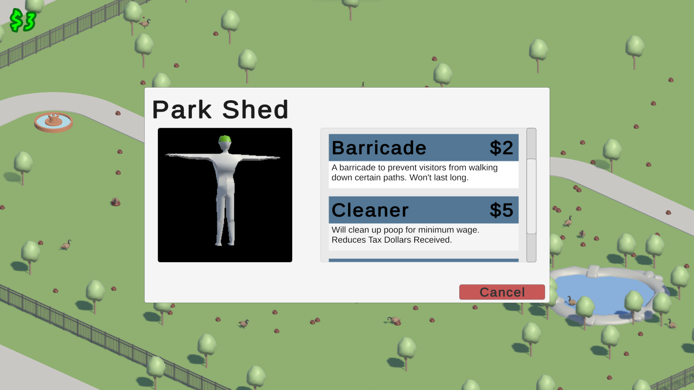

# Wild Deuce Chase (Ludum Dare 50 Jam)
  

## Description

You're a park manager overseeing the pride and joy of your local town: the park!  
Visitors come from far and wide ready to enjoy the amenities you've procured for them.  
One of them messed with the goose, now you must prepare for the deuce.  
Delay the inevitable, your visitors becoming dissatisfied with stepping in goose poo. If you need help and you have the taxes, you can stop by the maintenance shed and purchase some employees to help you out.

## Controls  

WASD - Movement  
LShift - Sprint  
RMB - Clean Poop / Interact with maintenance shed  
LMB - Pick up / Throw

## Screenshots  

  
*Main Menu*

  
*Park Manager doing their best, Geese eating some bread*

  
*The shed that keeps the geese fed .. somewhere else*

## Dependencies  
Unity 2021.2  

## Credits
- [Chris Brandt](https://github.com/pizzatree) 
- [Greg Brandt](https://github.com/BradleyGBrandt/)
- [Jacob Lawson](https://github.com/jacobright)
- [Jake Hyland](https://github.com/jhyland-r)